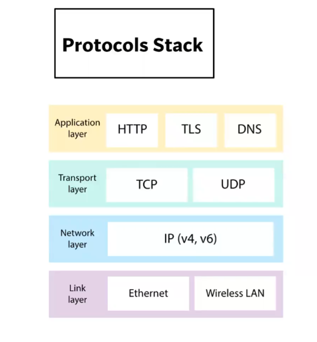
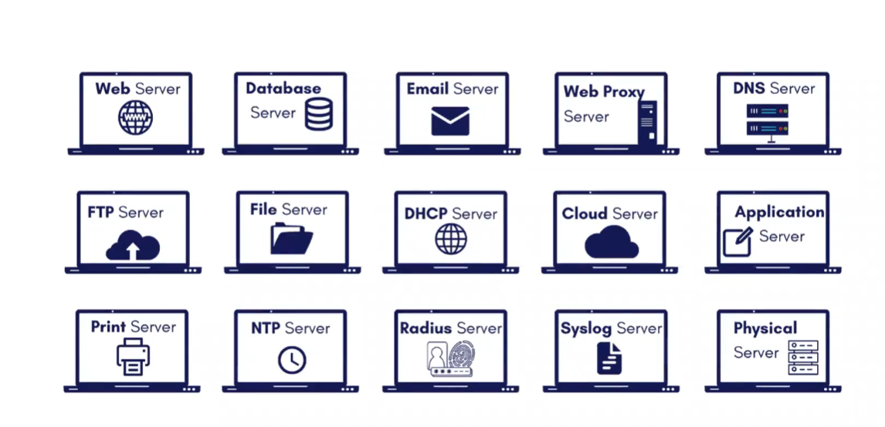
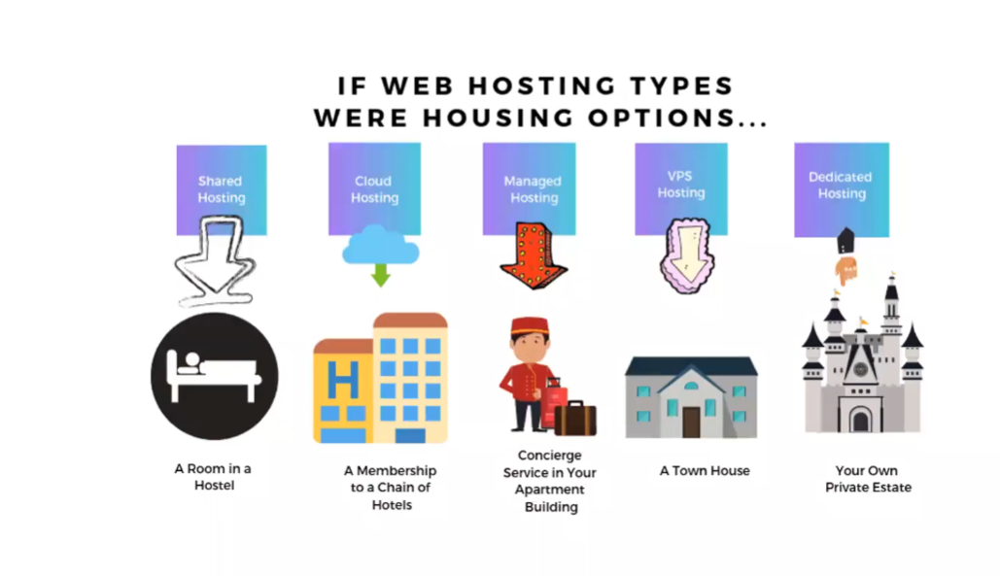
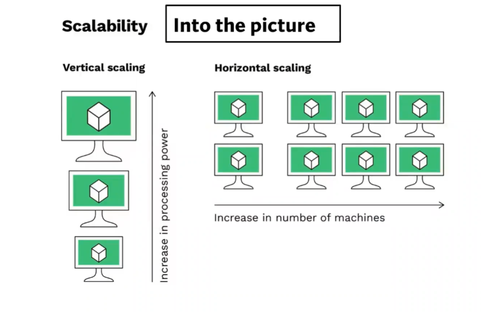
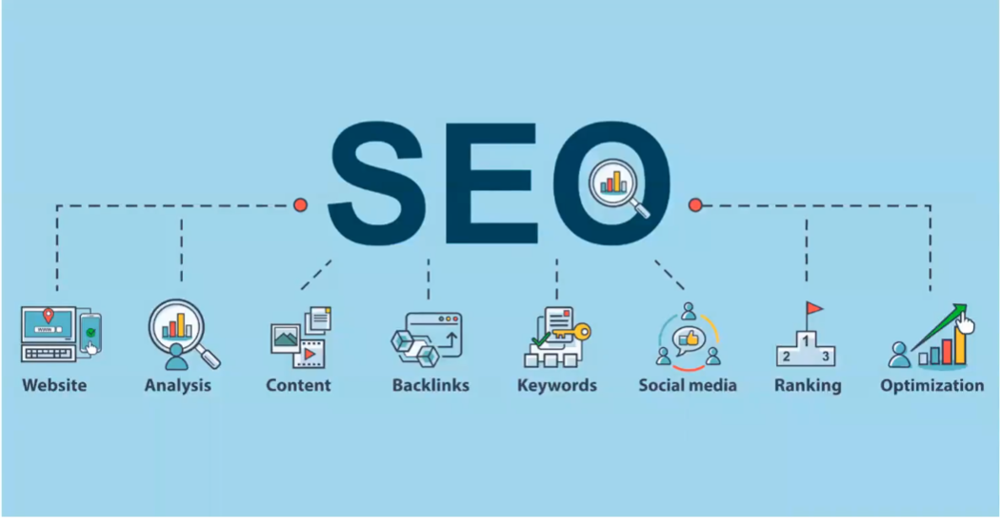

**Q- What is a protocol stack, and how is it used in web development?**

**A**- A very core level communication between client and server happens with the help of Protocols Stack. Whenever a IP address is entered or the browser gets it from DNS server , Now it will go to the webserver , It goes with help of protocols stack. A protocol stack or protocol suite is the architecture of a protocol that follows the layered architecture design principle. The functionality of the whole protocol is broken down into component protocols that are separately managed and can be treated and designed mostly independently from one another. A protocol stack typically contains a set of protocols where each protocol in the stack performs a specific task and is responsible for a well-defined function. The protocols are often referred to as layers with each layer providing services to the layer above it and receiving services from the layer below it.

**Q- What are the different types of web servers, and how do they differ in terms of functionality and performance?**
**A**- Every website sits on a computer known as a Web server. This server is always connected to the internet. Every Web server that is connected to the Internet is given a unique address made up of a series of four numbers between 0 and 255 separated by periods. For example, 68.178.157.132 or 68.122.35.127.
When you register a web address, also known as a domain name, such as www.xyz.com you have to specify the IP address of the Web server that will host the site. You can load up with Dedicated Servers that can support your web-based operations.
There are four leading web servers − Apache, IIS, lighttpd and Jagsaw

Different Web Servers

Web Servers can be used for making static websites (read only websites) example: Blog whereas if we want to go for dynamic websites (read+ write) example: Facebook we will use Application Server.
Open-Source Web Servers:

These are like tools which can be used for websites.

**Q- What is web hosting, and what are the different types of hosting services available for websites?**
**A**- When a hosting provider allocates space on a web server for a website to store its files, they are hosting a website. Web hosting makes the files that comprise a website (code, images, etc.) available for viewing online. Every website you’ve ever visited is hosted on a server.
The amount of space allocated on a server to a website depends on the type of hosting. The main types of hosting are shared, dedicated, VPS and reseller. They are differentiated by the kind of technology used for the server, the level of management provided and the additional services on offer.

Types Of Hosting –

**Q- What is scaling, and why is it important for web applications? How does scaling differ for vertical and horizontal scaling?**
**A**- With web applications potentially attracting vast amounts of traffic, scalability is a fundamental concern. It’s important to ensure that web apps can expand to handle traffic influxes and maintain performance and security.
Scalability refers to the potential of a web application to increase its ability to handle a heavier workload. During the first stages of application development, the app might be able to handle a certain number of users. If the application wasn’t designed to scale, increasing the number of users can lead to slow performance.
Horizontal scaling
Horizontal scaling describes adding more servers or nodes to infrastructure. This reduces the load on the server by distributing the workload to the added nodes. With horizontal scaling, we can keep our operations running on our current nodes as we add more.
Vertical scaling
Vertical scaling differs from horizontal scaling in that it involves adding more processing power to the existing infrastructure. With vertical scaling, we can increase the CPUs, RAM, network speed, storage, and more according to the workload. In some instances, vertical scaling can also mean replacing existing infrastructure with a more powerful infrastructure.

**Q- What is SEO (Search Engine Optimization), and how can web developers optimize their websites for better search engine rankings?**
**A**- SEO stands for “search engine optimization.” In simple terms, SEO means the process of improving your website to increase its visibility in Google, Microsoft Bing, and other search engines whenever people search for.

Six Ways to Improve your Site's Ranking (SEO)
1- Publish Relevant Keyword, Authoritative Content.
2- Metadata
3- Use alt tags
4- Update Your Content Regularly
5- Have a link-worthy site
6- Use Tools for traffic analytics like webmaster and google analytics.
